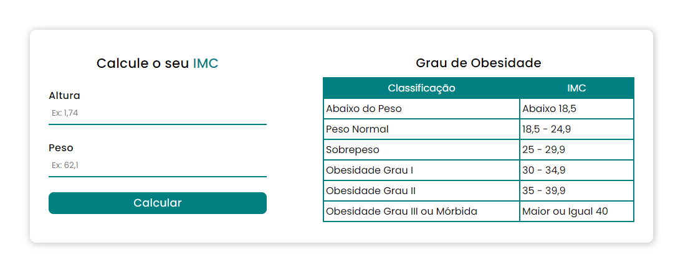

## Calculadora IMC

### Sobre

Esse projeto é uma calculadora de IMC(Índice de Massa Corporal).

<p> <strong> Importante: </strong> Desenvolvido para fins de estudos. </p>

<a href='https://p-bmi-calculate.netlify.app/'> Clique aqui para ver o projeto no ar. </a>



##

### Funcionalidades

* Você terá que digitar sua altura e seu peso;
* Usando a formúla pra calcular o IMC, irá ser calculado a sua altura e seu peso e assim mostrará seu IMC;

##

### Pré-requisitos

<p> Antes de começar, você precisa ter instalado em sua máquina a seguinte ferramenta <a href='https://git-scm.com/downloads'> Git </a>. Além disso, é preciso ter um bom editor para trabalhar com o código como o <a href='https://code.visualstudio.com/'> VSCode</a>. </p>

##

#### Rodando o projeto em sua máquina
 ``` bash
  # Clone esse repositório
  $ git clone <https://github.com/pedrosouz6/bmi-calculate>
  
  # Entre na pasta e abra o index.html no navegador
```

##

### Tecnologias usadas

<div style='display: flex;'>
  
  
  
</div>

## 

<p> Desenvolvido por Pedro Souza </p>
